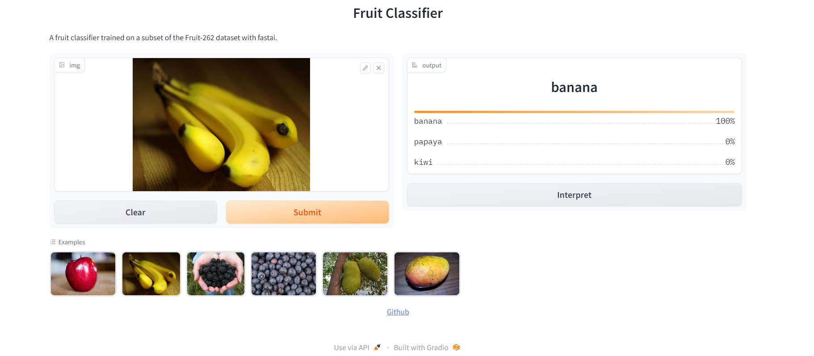

# fruit_classifier_fastai
A fruit classifier trained on a subset of the Fruit-262 dataset with fastai

## Demo
Check out the gradio demo [here](https://huggingface.co/spaces/fakeone129/fastai_fruit_classifier).
 

## Dataset
The Dataset used here is the [Kaggle Fruit-262](https://www.kaggle.com/datasets/aelchimminut/fruits262?select=Fruit-262). 
